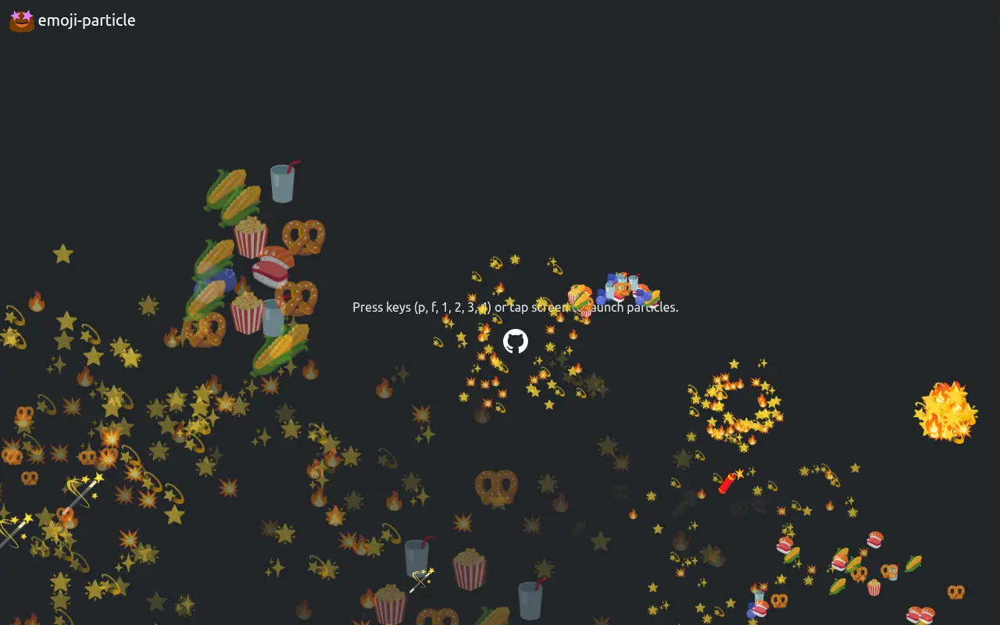

# emoji-particle

Fireworks and popcorn particle effects using emojis.



## Demo

- [Basic Usage](https://hoge.github.io/emoji-particle/)

## Build

```
bash build.sh
```

## Usage

### Load library

Make sure to not get a 3D context from the canvas before calling
transferControlToOffscreen(), otherwise it will throw an error.

```js
const offscreen = canvas.transferControlToOffscreen();
const worker = new Worker("emoji-particle.js");
worker.postMessage({ type: "init", canvas: offscreen }, [offscreen]);
```

### Resize setting

```js
globalThis.addEventListener("resize", () => {
  const width = document.documentElement.clientWidth;
  const height = document.documentElement.clientHeight;
  worker.postMessage({ type: "resize", width, height });
});
```

### Generate particles

```js
worker.postMessage({ type: "spawn", options });
```

#### Common Spawn Options

| Option        | Type                      | Description                                     | Default (Popcorn) | Default (Rocket) | Default (Explosion) |
| ------------- | ------------------------- | ----------------------------------------------- | ----------------- | ---------------- | ------------------- |
| particleType  | string                    | "popcorn" or "rocket"                           | "popcorn"         | "rocket"         | -                   |
| count         | number                    | Number of particles to spawn                    | 20                | 1                | 20                  |
| originX       | number                    | X-coordinate of spawn position (px)             | width / 2         | width / 2        | -                   |
| originY       | number                    | Y-coordinate of spawn position (px)             | height / 2        | height           | -                   |
| minSpeed      | number                    | Minimum initial speed of particles              | 5                 | 8                | 2                   |
| maxSpeed      | number                    | Maximum initial speed of particles              | 10                | 10               | 7                   |
| angle         | number                    | Base direction in radians (-Math.PI/2 = upward) | -Math.PI / 2      | -Math.PI / 2     | 0..2π randomized    |
| angleVariance | number                    | Spread around base direction (radians)          | Math.PI / 6       | 0                | 0..2π randomized    |
| gravity       | number                    | Gravity applied per frame                       | 0.2               | 0.05             | 0.1                 |
| lifeTime      | number                    | Lifetime of particle in frames                  | 100               | 60               | 80                  |
| fade          | boolean                   | Whether particle fades out over time            | true              | true             | true                |
| size          | number                    | Emoji rendering size in pixels                  | 20                | 30               | 22                  |
| emojiList     | (string \| ImageBitmap)[] | Array of emoji strings or preloaded images      | see Emoji List    | see Emoji List   | see Emoji List      |

#### Rocket-specific Options

Only for `particleType: "rocket"`:

| Option           | Type   | Description                | Default |
| ---------------- | ------ | -------------------------- | ------- |
| explosionOptions | object | Defines explosion behavior | {}      |

#### Emoji List

| Context                    | particleType         | Default                           |
| -------------------------- | -------------------- | --------------------------------- |
| Popcorn particles          | `popcorn`            | `["🍿","🌽","🥤","🥨","🫐","🍣"]` |
| Rocket particles           | `rocket`             | `["🚀","🧨","💣","🪄","🛸"]`      |
| Rocket explosion particles | `rocket` (explosion) | `["✨","⭐️","💥","🌟","🔥","💫"]` |

## Examples

Popcorn particles:

```js
worker.postMessage({
  type: "spawn",
  options: {
    particleType: "popcorn",
    count: 20,
    originX: Math.random() * globalThis.innerWidth,
    originY: Math.random() * globalThis.innerHeight,
    minSpeed: 7,
    maxSpeed: 10,
    angle: -Math.PI / 2,
    angleVariance: Math.PI / 2,
    gravity: 0.2,
    lifeTime: 120,
    fade: true,
    size: 20,
  },
});
```

Fireworks particles:

```js
worker.postMessage({
  type: "spawn",
  options: {
    particleType: "rocket",
    count: 1,
    originX: Math.random() * globalThis.innerWidth,
    originY: globalThis.innerHeight,
    minSpeed: 8,
    maxSpeed: 10,
    angle: -Math.PI/2,
    angleVariance: 0,
    gravity: 0.05,
    lifeTime: 60,
    fade: true,
    size: 30,
    explosionOptions: {
      count: 80,
      size: 24,
      minSpeed: 2,
      maxSpeed: 6,
      gravity: 0.1,
      lifeTime: 80,
      fade: true
    }
  });
```

## License

MIT

## Attribution

`src/favicon/favicon.svg` is cloned from
[Blobmoji](https://github.com/C1710/blobmoji) is licensed under the
[Apache-2.0](https://github.com/C1710/blobmoji/blob/main/LICENSE)
